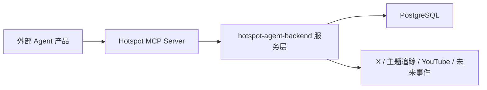

# 热点数据 MCP 对外访问方案

## 1. 背景

其他 Agent 产品希望使用本系统已经采集和整理过的热点数据，包括 X 热搜、重点主题帖子、YouTube 爆款视频、未来事件、热点事件、证据链和运营承接信息。

如果只开放数据库或普通 REST API，外部 Agent 很难准确理解这些数据的业务含义：

- `Signal`、`Event`、`Evidence`、`Topic Watch` 的边界不直观。
- 外部 Agent 不一定知道哪些字段适合展示，哪些字段只是系统内部字段。
- 直接返回数据库 ID、JSON 字段或中间状态，容易导致误用。
- 不同外部 Agent 需要的上下文粒度不同，不能要求它们都理解本系统内部表结构。

因此，需要封装一层面向 Agent 的数据访问能力，让外部 Agent 可以通过标准工具调用理解和使用热点数据。

## 2. 核心结论

建议新增一个 **Hotspot MCP Server**，作为外部 Agent 访问热点数据的只读工具层。

MCP Server 不负责采集、挖掘、聚合、内容生成和运营决策，它只负责把本系统已有的数据能力封装为外部 Agent 能理解的工具。



第一期 MCP 定位为：

```text
热点情报只读工具层。
```

暂时不开放修改配置、删除数据、触发采集、确认事件、采用选题等写操作。

## 3. 为什么选择 MCP

### 3.1 MCP 比直接开放数据库更合适

数据库是系统内部实现，不是外部 Agent 的稳定契约。

直接开放数据库会带来几个问题：

- 外部 Agent 需要理解表结构。
- 表结构调整会影响外部系统。
- 很难表达字段含义、可信度、证据口径和使用限制。
- 权限控制粒度太粗。
- 外部系统可能绕过业务语义直接读取中间数据。

MCP 工具可以把复杂内部数据封装成稳定的业务接口。

### 3.2 MCP 比普通 REST API 更适合 Agent

普通 REST API 适合确定性程序调用，但 Agent 更需要“工具语义”：

- 这个工具适合解决什么问题。
- 输入字段应该怎么填写。
- 返回结果代表什么业务含义。
- 什么情况下应该继续调用另一个工具。
- 哪些数据不能被当作事实结论。

MCP 工具天然可以通过工具描述、输入 schema 和结构化输出来帮助模型理解工具能力。

## 4. 设计原则

### 4.1 只暴露业务语义，不暴露内部实现

MCP 返回给外部 Agent 的数据不应该是数据库裸字段，而应该是语义化结果。

不推荐：

```json
{
  "evidenceRefs": ["cmt9xxxx"]
}
```

推荐：

```json
{
  "evidence": [
    {
      "source": "X",
      "author": "@Polymarket",
      "publishedAt": "2026-08-31T10:00:00.000Z",
      "url": "https://x.com/...",
      "summary": "Polymarket 发布了关于某事件的帖子。",
      "metrics": {
        "views": 428000,
        "likes": 1200,
        "replies": 35,
        "reposts": 80
      }
    }
  ]
}
```

### 4.2 输出默认中文

本系统已经要求事件标题、摘要、触发原因、拆解内容和运营承接信息统一中文。MCP 对外输出也应默认使用中文。

如果外部 Agent 需要英文，可以后续在工具输入中增加：

```json
{
  "language": "zh-CN"
}
```

第一期默认固定中文，减少复杂度。

### 4.3 MCP 层只读

第一期只开放查询能力：

- 查热点事件。
- 查事件详情。
- 查原始信号。
- 查系统字段含义。
- 查重点主题帖子榜。
- 查 YouTube 爆款视频。

不开放写能力：

- 不修改采集配置。
- 不修改规则包。
- 不触发数据采集。
- 不创建事件。
- 不删除数据。
- 不代表运营人员做采用或拒绝。

### 4.4 稳定契约优先

外部 Agent 依赖的是 MCP 工具返回结构，不应该依赖数据库表字段。

后续数据库怎么调整，只要 MCP 输出契约不变，外部 Agent 就不需要改。

## 5. MCP Server 部署形态

### 5.1 推荐方案：内置在当前后端服务中

在当前 `hotspot-agent-backend` 中新增 MCP 模块，对外暴露 MCP endpoint。

优点：

- 可以复用现有 service、repository、配置、日志和鉴权。
- 不需要额外部署一个服务。
- 与业务数据模型保持一致。
- 避免 MCP Server 重复实现数据访问逻辑。

缺点：

- 当前后端需要同时承载业务 API 和 MCP 协议。
- 需要在模块边界上控制好外部只读权限。

适合当前阶段。

### 5.2 备选方案：独立 MCP 服务

单独创建 `hotspot-mcp-server`，通过 HTTP 调用当前后端 API。

优点：

- 服务边界清晰。
- 可独立部署、扩容、限流。
- 更适合未来开放给多个外部系统。

缺点：

- 多一个服务要部署和维护。
- 需要额外处理鉴权、服务发现、错误映射。
- 容易和后端业务语义脱节。

### 5.3 当前建议

第一期使用内置方案。

当满足以下条件时，再拆成独立服务：

- 有多个外部 Agent 产品稳定接入。
- 外部调用量明显影响主服务。
- 需要独立的版本发布节奏。
- 需要对不同租户做复杂限流、审计和权限隔离。

## 6. 第一批 MCP 工具

### 6.1 `get_system_taxonomy`

#### 目的

让外部 Agent 先理解本系统的数据语义。

#### 适用问题

- “这个热点系统里有哪些数据类型？”
- “Signal 和 Event 有什么区别？”
- “事件领域有哪些固定值？”
- “标签里的 Top5、Fast Rising、第一方确认是什么意思？”

#### 输入

无需输入。

#### 输出

```ts
interface SystemTaxonomyResult {
  entities: Array<{
    name: string
    description: string
  }>
  signalTypes: Array<{
    code: string
    name: string
    description: string
  }>
  eventDomains: string[]
  sourceAndHeatLabels: Array<{
    code: string
    name: string
    description: string
  }>
  confidenceLevels: Array<{
    code: string
    description: string
  }>
}
```

#### 说明

这是外部 Agent 的“说明书工具”。如果外部 Agent 不理解字段含义，可以先调用它。

### 6.2 `search_hot_events`

#### 目的

查询当前已经形成的热点事件。

#### 适用问题

- “最近有什么热点事件？”
- “AI 领域最近有哪些热点？”
- “X 热搜产生的事件有哪些？”
- “最近有哪些 Top5 或 Fast Rising 事件？”

#### 输入

```ts
interface SearchHotEventsInput {
  query?: string
  domains?: string[]
  sources?: string[]
  labels?: string[]
  since?: string
  limit?: number
}
```

字段说明：

- `query`：关键词，可为空。
- `domains`：事件领域，例如 `AI`、`Crypto & Web3`。
- `sources`：来源，例如 `X Trend`、`Topic Circle`、`Future Event`。
- `labels`：触发标签，例如 `Top5`、`Fast Rising`、`第一方确认`。
- `since`：只查某个时间之后的事件。
- `limit`：返回数量，默认 20，最大 50。

#### 输出

```ts
interface HotEventListItem {
  eventId: string
  title: string
  summary: string
  domains: string[]
  sourceLabels: string[]
  heatLabels: string[]
  triggerReason?: string
  confidence: string
  status: string
  evidenceCount: number
  occurredAt?: string
  observedAt?: string
  updatedAt: string
}
```

#### 注意

列表接口不返回完整证据链，只返回摘要和可筛选字段。需要详情时调用 `get_hot_event_detail`。

### 6.3 `get_hot_event_detail`

#### 目的

获取单个热点事件的完整上下文，方便外部 Agent 做分析、选题或内容生成。

#### 适用问题

- “解释一下这个事件为什么值得关注。”
- “给我这个事件的证据链。”
- “这个事件适合从什么角度写内容？”
- “把这个事件整理成可供 Agent 使用的上下文。”

#### 输入

```ts
interface GetHotEventDetailInput {
  eventId: string
  includeRawSignals?: boolean
  includePromptContext?: boolean
}
```

字段说明：

- `eventId`：热点事件 ID。
- `includeRawSignals`：是否返回关联 Signal 的精简原始数据，默认 `false`。
- `includePromptContext`：是否额外返回一段适合直接放进大模型的中文上下文文本，默认 `true`。

#### 输出

```ts
interface HotEventDetail {
  event: {
    eventId: string
    title: string
    summary: string
    domains: string[]
    sourceLabels: string[]
    heatLabels: string[]
    triggerReason?: string
    confidence: string
    status: string
    occurredAt?: string
    observedAt?: string
    updatedAt: string
  }
  evidence: Array<{
    evidenceId: string
    source: string
    sourceName?: string
    authorName?: string
    authorHandle?: string
    title?: string
    text?: string
    summary?: string
    url?: string
    publishedAt?: string
    observedAt?: string
    metrics?: Record<string, number | string | null>
    verificationStatus?: string
  }>
  timeline: Array<{
    time: string
    type: string
    title: string
    description?: string
  }>
  missingData: string[]
  riskNotes: string[]
  promptContext?: string
}
```

#### promptContext 示例

```text
【事件】
标题：OpenAI 发布 GPT-6 API
摘要：OpenAI 官方宣布新 API，多个来源随后指向同一核心事件。
领域：AI
触发原因：该事件首次进入 X 热搜 Top 5，并被第一方账号确认。

【证据】
1. OpenAI 官方账号于 08/26 16:28 发布相关公告，链接：https://...
2. 多个行业账号在 2 小时内转发讨论。

【风险】
- 不要把市场概率写成事实。
- 官方尚未确认部分产品细节。
```

### 6.4 `search_signals`

#### 目的

查询原始或标准化后的信号。

#### 适用问题

- “最近采集到了哪些 X 热搜？”
- “YouTube 最近有哪些爆款视频？”
- “主题圈最近有哪些帖子？”
- “未来事件源最近发现了什么？”

#### 输入

```ts
interface SearchSignalsInput {
  signalType?: string
  platform?: string
  query?: string
  since?: string
  limit?: number
}
```

#### 输出

```ts
interface SignalListItem {
  signalId: string
  signalType: string
  platform?: string
  sourceName?: string
  title?: string
  summary?: string
  url?: string
  publishedAt?: string
  observedAt: string
  metrics?: Record<string, number | string | null>
  linkedEventIds: string[]
}
```

#### 注意

Signal 是进入 Agent 系统前的统一抽象。外部 Agent 如果只是想找灵感，可以查 Signal；如果想使用已经过系统判断的热点，应查 Event。

### 6.5 `get_topic_watch_posts`

#### 目的

查询重点主题追踪下的帖子榜。

#### 适用问题

- “预测市场主题最近哪些账号发了热门帖子？”
- “AI 与科技主题圈内榜是什么？”
- “某个主题下哪些帖子可能形成热点？”

#### 输入

```ts
interface GetTopicWatchPostsInput {
  topicWatchId?: string
  topicName?: string
  leaderboardType?: 'inside' | 'global' | 'rising'
  limit?: number
}
```

#### 输出

```ts
interface TopicWatchPostItem {
  postSignalId: string
  topicWatchId: string
  topicWatchName: string
  authorName?: string
  authorHandle?: string
  authorRole?: string
  sourcePermission?: string
  text: string
  summary: string
  url?: string
  publishedAt?: string
  observedAt: string
  metrics: {
    views?: number
    likes?: number
    replies?: number
    reposts?: number
  }
  rank?: number
  status: string
  linkedEventIds: string[]
}
```

### 6.6 `get_youtube_breakout_videos`

#### 目的

查询 YouTube 爆款视频和拆解结果。

#### 适用问题

- “最近有哪些 YouTube 爆款视频？”
- “哪些视频已经完成拆解？”
- “这个视频为什么火？”
- “有没有可复刻的内容结构？”

#### 输入

```ts
interface GetYoutubeBreakoutVideosInput {
  query?: string
  analyzedOnly?: boolean
  channel?: string
  since?: string
  limit?: number
}
```

#### 输出

```ts
interface YoutubeBreakoutVideoItem {
  videoSignalId: string
  title: string
  channelTitle?: string
  url: string
  thumbnailUrl?: string
  publishedAt?: string
  observedAt: string
  metrics: {
    views?: number
    likes?: number
    comments?: number
  }
  analysisStatus: 'none' | 'succeeded' | 'failed'
  analysis?: {
    summary: string
    whyItWorks: string[]
    contentStructure: string[]
    reusableAngles: string[]
    productConnectionIdeas: string[]
  }
}
```

### 6.7 后续可扩展工具

第二期可以增加：

- `get_future_events`：查询未来事件日历和监控计划。
- `get_operation_recommendations`：查询运营决策中心里的选题推荐。
- `get_event_evidence_chain`：单独查询证据链。
- `get_event_prompt_context`：只返回适合外部模型使用的上下文文本。
- `search_by_product_angle`：按产品承接方向查询热点。

## 7. 数据语义映射

### 7.1 Signal

`Signal` 是各种来源数据进入 Agent 系统前的统一抽象。

来源可以是：

- X 热搜词。
- X 帖子。
- YouTube 视频。
- 未来事件监控结果。
- 搜索结果。
- 行业话题。
- 人工导入上下文。

Signal 适合用来做“发现灵感”和“查看原始观察”。

### 7.2 Event

`Event` 是系统经过热点挖掘、事件判断、事实整理后形成的热点事件。

Event 适合用来做：

- 热点分析。
- 内容选题。
- 运营决策。
- 外部 Agent 内容生成。

### 7.3 Evidence

`Evidence` 是支撑 Event 的具体事实依据。

Evidence 应尽量包含：

- 来源平台。
- 来源账号或来源名称。
- 原文或摘要。
- 原始链接。
- 发布时间。
- 系统采集时间。
- 指标数据。

外部 Agent 在生成内容时，应优先引用 Evidence，而不是只引用 Event 摘要。

### 7.4 Topic Watch

`Topic Watch` 是对重点主题、圈层账号和相关帖子的持续追踪。

它适合回答：

- 某个主题下谁在讨论。
- 哪些帖子变热。
- 哪些账号具有第一方权威或单点权限。
- 主题下是否有新的事件线索。

### 7.5 YouTube Breakout Video

YouTube 爆款视频不是实时新闻事件，更适合作为内容结构、表达方式、选题角度和复刻灵感来源。

## 8. 鉴权与权限

### 8.1 API Key

每个外部 Agent 产品分配一个独立的 MCP API Key。

建议请求头：

```text
Authorization: Bearer <HOTSPOT_MCP_API_KEY>
```

### 8.2 权限模型

第一期只需要只读权限：

```ts
interface McpClientPermission {
  clientId: string
  name: string
  scopes: Array<
    | 'hot_events:read'
    | 'signals:read'
    | 'topic_watch:read'
    | 'youtube:read'
    | 'taxonomy:read'
  >
  enabled: boolean
}
```

不同工具对应不同 scope：

| 工具 | 权限 |
|---|---|
| `get_system_taxonomy` | `taxonomy:read` |
| `search_hot_events` | `hot_events:read` |
| `get_hot_event_detail` | `hot_events:read` |
| `search_signals` | `signals:read` |
| `get_topic_watch_posts` | `topic_watch:read` |
| `get_youtube_breakout_videos` | `youtube:read` |

### 8.3 调用审计

每次外部调用建议记录：

- `clientId`
- `toolName`
- `arguments`
- `status`
- `durationMs`
- `errorCode`
- `createdAt`

审计日志不一定第一期建表，也可以先写结构化日志。等外部调用稳定后再入库。

## 9. 错误设计

MCP 工具错误应返回可被 Agent 理解的结构，而不是直接暴露内部异常。

示例：

```json
{
  "error": {
    "code": "HOT_EVENT_NOT_FOUND",
    "message": "未找到指定热点事件。",
    "retryable": false,
    "suggestion": "请先调用 search_hot_events 获取可用 eventId。"
  }
}
```

常见错误：

| 错误码 | 含义 |
|---|---|
| `UNAUTHORIZED` | API Key 缺失或无效 |
| `FORBIDDEN` | 没有调用该工具的权限 |
| `HOT_EVENT_NOT_FOUND` | 事件不存在 |
| `SIGNAL_NOT_FOUND` | 信号不存在 |
| `INVALID_ARGUMENTS` | 输入参数不合法 |
| `LIMIT_EXCEEDED` | 请求数量超过限制 |
| `INTERNAL_ERROR` | 服务内部错误 |

## 10. 返回数据控制

### 10.1 默认限制

为了避免外部 Agent 一次拿太多数据：

- 列表工具默认 `limit = 20`。
- 列表工具最大 `limit = 50`。
- 详情工具默认不返回大段原始 JSON。
- 大字段需要显式开启，例如 `includeRawSignals`。

### 10.2 敏感字段过滤

MCP 不返回：

- API Key。
- 内部任务调度配置。
- 原始请求头。
- 内部错误堆栈。
- 数据库连接信息。
- 未面向外部解释的中间状态。

### 10.3 Agent 友好的字段命名

字段命名应偏业务语义：

- `triggerReason` 优于 `reason`。
- `sourceLabels` 优于 `labels`。
- `evidence` 优于 `evidenceRefs`。
- `promptContext` 优于 `contextText`。

## 11. 与现有 API 的关系

MCP 工具可以复用已有后端 service，不要求重写业务逻辑。

建议分层：

```text
Controller / REST API
  面向前端页面

MCP Tool Adapter
  面向外部 Agent

Application Service
  业务用例层

Repository
  数据访问层
```

MCP Tool Adapter 的职责：

- 校验工具输入。
- 调用 Application Service。
- 把内部数据转换为 Agent 友好的输出。
- 过滤不应对外暴露的字段。
- 生成中文说明性上下文。

## 12. 第一阶段实现计划

### 12.1 后端模块

新增模块：

```text
src/mcp/
  mcp.module.ts
  mcp.controller.ts
  mcp-auth.guard.ts
  mcp-tool-registry.ts
  tools/
    get-system-taxonomy.tool.ts
    search-hot-events.tool.ts
    get-hot-event-detail.tool.ts
    search-signals.tool.ts
```

### 12.2 第一批工具

第一期实现 4 个工具：

1. `get_system_taxonomy`
2. `search_hot_events`
3. `get_hot_event_detail`
4. `search_signals`

这 4 个工具已经能满足外部 Agent 的基础热点情报需求。

### 12.3 第二批工具

第二期实现：

1. `get_topic_watch_posts`
2. `get_youtube_breakout_videos`
3. `get_future_events`

### 12.4 第三批工具

第三期考虑开放运营决策数据：

1. `get_operation_recommendations`
2. `get_product_association_context`

第三期仍然保持只读，暂不允许外部 Agent 代替运营人员做采用、拒绝或发布决策。

## 13. 测试策略

### 13.1 工具单测

每个工具至少测试：

- 输入参数合法时返回语义化结构。
- limit 超过最大值会被截断或报错。
- 无权限时拒绝调用。
- 找不到数据时返回明确错误。

### 13.2 契约测试

MCP 输出结构要有契约测试，避免后续字段改名导致外部 Agent 接入失败。

重点保护字段：

- `eventId`
- `title`
- `summary`
- `domains`
- `sourceLabels`
- `heatLabels`
- `triggerReason`
- `evidence`
- `promptContext`

### 13.3 集成测试

用一组测试数据验证完整链路：

```text
创建 Signal
→ 创建 Event
→ 绑定 Evidence
→ MCP search_hot_events 能查到
→ MCP get_hot_event_detail 能返回完整证据和 promptContext
```

## 14. 外部 Agent 推荐调用方式

### 14.1 找热点

```text
调用 get_system_taxonomy 理解系统字段
调用 search_hot_events 查最近热点
选择一个 eventId
调用 get_hot_event_detail 获取完整上下文
基于 promptContext 做分析或内容生成
```

### 14.2 找原始灵感

```text
调用 search_signals
筛选 sourceType 或 query
发现还未形成事件但值得关注的信号
如需要事件级上下文，再查询 linkedEventIds
```

### 14.3 做视频灵感

```text
调用 get_youtube_breakout_videos
筛选已拆解视频
读取 analysis 中的 whyItWorks / reusableAngles
结合自身产品生成内容方向
```

## 15. 风险与边界

### 15.1 外部 Agent 误把观点当事实

解决方式：

- MCP 输出中区分 `summary`、`evidence`、`riskNotes`。
- `promptContext` 明确提示不要把预测市场概率、账号观点或系统判断写成事实。

### 15.2 返回数据太多导致上下文膨胀

解决方式：

- 列表工具只返回摘要。
- 详情工具默认返回精简证据。
- 大字段需要显式开启。
- 给 `limit` 设置最大值。

### 15.3 外部 Agent 依赖不稳定字段

解决方式：

- MCP 输出作为稳定契约。
- 内部字段不直接透出。
- 增加契约测试。

### 15.4 权限边界扩大

解决方式：

- 第一阶段只读。
- 写操作单独设计，不和查询工具混在一起。
- 每个外部系统独立 API Key 和权限 scope。

## 16. MVP 验收标准

第一期完成后，应满足：

- 外部 Agent 可以通过 MCP 查询最近热点事件。
- 外部 Agent 可以获取单个事件的完整中文上下文。
- 外部 Agent 可以看到事件证据链中的真实链接和来源信息。
- 外部 Agent 可以查询原始 Signal。
- 外部 Agent 可以调用工具了解系统的数据分类、标签和字段含义。
- MCP 不暴露数据库裸结构和敏感字段。
- 所有工具都有基础单测和契约测试。

## 17. 推荐落地顺序

```text
第一步：定义 MCP 输出 DTO 和字段语义
第二步：实现 get_system_taxonomy
第三步：实现 search_hot_events
第四步：实现 get_hot_event_detail
第五步：实现 search_signals
第六步：增加 API Key 鉴权
第七步：补契约测试
第八步：给外部 Agent 提供接入说明
```

## 18. 最终建议

本系统不应该把数据库、内部接口或后台页面直接暴露给外部 Agent。

更合理的方式是：

```text
内部系统继续负责采集、挖掘、聚合、证据整理和运营决策；
MCP Server 只负责把这些结果包装成外部 Agent 能理解、能安全调用、结构稳定的热点情报工具。
```

第一期先做只读 MCP 工具，重点打通：

- 热点事件发现。
- 热点事件详情。
- 证据链。
- 原始信号查询。
- 数据语义说明。

这样既能让其他 Agent 产品快速使用热点数据，又不会把当前系统变成一个不可控的远程操作入口。
