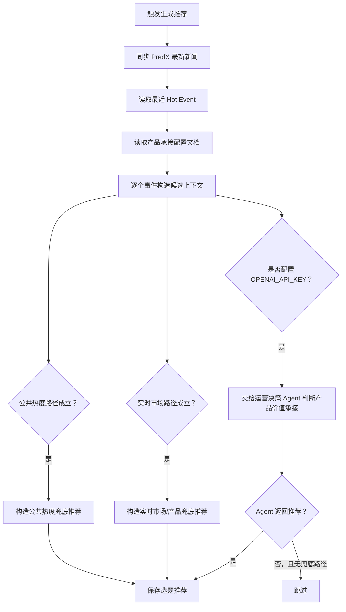

# 运营决策选题推荐生成流程

## 1. 目标

选题推荐不是内容生成，也不是自动发布。

它的目标是：从已经进入系统的热点事件、公共热度信号和 PredX 产品数据中，找出值得运营人员判断的选题，并给出可选择的承接角度。

## 2. 当前输入

当前后端生成推荐时读取：

- 最近的 Hot Event；
- PredX 最新新闻接口；
- PredX 热点—产品承接基础配置文档；
- Hot Event 自身携带的标签、触发原因、来源摘要和证据引用。

## 3. 三条推荐路径

### 3.1 公共热度

当事件上下文标记出代表内容进入 X 短时增速排行榜前 3 时，进入选题推荐。

当前代码识别字段：

- `sourceSummary.publicHeatRank <= 3`
- `sourceSummary.shortTermGrowthRank <= 3`
- `sourceSummary.representativePostGrowthRank <= 3`
- 或事件标签包含 `公共热度`

公共热度路径不要求一定存在 PredX 市场，也不强行生成产品承接。它可以先进入人工判断，由运营人员决定是否继续寻找承接角度。

### 3.2 实时市场承接

当事件与 PredX 最新新闻中带有 `primaryMarketTitle` 和 `primaryMarketUrl` 的市场数据匹配时，进入选题推荐。

当前代码会把该路径标记为：

- 推荐标签：`实时市场`
- 推荐依据：`market`
- 连接层级：默认 `L1_direct`

注意：这里的市场匹配来自运行时接口结果，不等于 PredX 产品页面已经正式展示该关系。

### 3.3 PredX 产品价值承接

当事件不一定有直接市场，但可能命中 L1、L2、L3、L4 任一产品承接层级时，也应该进入 Agent 判断。

当前代码在配置了 `OPENAI_API_KEY` 时，会把没有 PredX 新闻关键词匹配的事件也交给运营决策 Agent，由 Agent 结合产品承接规则文档判断是否生成推荐。

如果 Agent 返回 `status: none`，且没有公共热度或实时市场兜底路径，则跳过该事件。

## 4. 生成顺序



## 5. 自动调度

后端启动后会注册运营决策选题推荐定时任务。

默认每 3 小时执行一次，执行内容等价于调用一次推荐生成流程：

- 同步 PredX 最新新闻；
- 读取最近 Hot Event；
- 判断公共热度、实时市场承接和 PredX 产品价值承接；
- 将符合条件的结果写入选题推荐。

为了避免浪费和重复执行，调度器会每分钟检查一次是否到期，但只有距离上次执行已满 3 小时时才真正运行。

手动补跑接口仍然保留：

```http
POST /operations-decision/recommendations/run
```

可选环境变量：

- `OPERATIONS_DECISION_RECOMMENDATION_SCHEDULER_ENABLED=false`：关闭自动选题推荐；
- `OPERATIONS_DECISION_RECOMMENDATION_INTERVAL_MS=10800000`：覆盖默认 3 小时间隔。

## 6. 当前边界

- 公共热度依赖事件上下文里已经写入短时增速排名字段；如果上游没有写入，当前不会重新计算全局短时增速榜。
- 实时市场匹配当前仍以 PredX 新闻接口中的市场字段为主，不是完整市场搜索。
- 产品价值承接依赖大模型判断；没有 `OPENAI_API_KEY` 时，只会生成公共热度或实时市场兜底推荐。
- 人工上下文收件箱目前还没有自动进入选题推荐生成链路。
