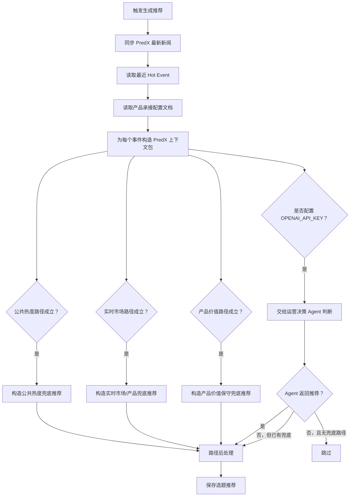

# 运营决策选题推荐生成流程

## 1. 目标

选题推荐不是内容生成，也不是自动发布。

它的目标是：从已经进入系统的热点事件、公共热度信号和 PredX 产品数据中，找出值得运营人员判断的选题，并给出可选择的承接角度。

## 2. 当前输入

当前后端生成推荐时读取：

- 最近的 Hot Event；
- PredX 最新新闻接口；
- PredX 热点—产品承接基础配置文档；
- Hot Event 自身携带的标签、触发原因、来源摘要和证据引用。

生成时不会只看 Hot Event。系统会先同步 PredX 最新新闻，再为每个事件构造一个小型 PredX 上下文包，供 Agent 判断是否存在承接价值。

PredX 上下文包由三部分组成：

- 与事件标题、摘要、标签存在关键词重合的 PredX 新闻；
- 与事件领域相近的 PredX 新闻，例如 `Geopolitics & Conflict` 会匹配 `geopolitics` 类新闻；
- 最新 PredX 新闻兜底，用来让 Agent 至少能看到当前产品侧正在覆盖什么。

这样做的原因是：运营选题不一定要求事件和 PredX 新闻标题完全相同。很多时候，选题成立来自同领域、同类型不确定性或相似事件结构。

## 3. 三条推荐路径

### 3.1 公共热度

当事件上下文标记出代表内容进入 X 短时增速排行榜前 3 时，进入选题推荐。

当前代码识别字段：

- `sourceSummary.publicHeatRank <= 3`
- `sourceSummary.shortTermGrowthRank <= 3`
- `sourceSummary.representativePostGrowthRank <= 3`
- 或事件标签包含 `公共热度`

公共热度路径不要求一定存在 PredX 市场，也不强行生成产品承接。它可以先进入人工判断，由运营人员决定是否继续寻找承接角度。

### 3.2 实时市场承接

当事件与 PredX 最新新闻中带有 `primaryMarketTitle` 和 `primaryMarketUrl` 的市场数据匹配时，进入选题推荐。

当前代码会把该路径标记为：

- 推荐标签：`实时市场`
- 推荐依据：`market`
- 连接层级：默认 `L1_direct`

注意：这里的市场匹配来自运行时接口结果，不等于 PredX 产品页面已经正式展示该关系。

### 3.3 PredX 产品价值承接

当事件不一定有直接市场，但可能命中 L1、L2、L3、L4 任一产品承接层级时，也应该进入 Agent 判断。

当前代码会根据事件领域标签判断是否具备 PredX 产品价值承接可能。以下领域默认属于可承接范围：

- `AI`
- `Technology`
- `Politics & Elections`
- `Geopolitics & Conflict`
- `Macro & Financial Markets`
- `Crypto & Web3`
- `Prediction Markets`
- `Official Schedule`

如果配置了 `OPENAI_API_KEY`，系统会把事件、PredX 上下文包和产品承接规则文档交给运营决策 Agent，由 Agent 判断是否生成推荐。

如果 Agent 返回 `status: none`，但事件本身命中了产品价值承接范围，系统仍会生成一条保守的产品价值推荐。该推荐不会伪装成直接市场匹配，只会引导到 PredX News，并提示运营人员从事件后续、未知变量和市场反应角度判断是否采用。

如果没有配置 `OPENAI_API_KEY`，产品价值路径仍可使用保守兜底生成推荐，避免在有明确领域标签时完全没有数据。

如果事件既没有公共热度、也没有实时市场匹配、也没有命中产品价值领域，则跳过该事件。

## 4. 路径后处理

Agent 可以发散判断，但最终落库前必须经过路径后处理，避免标签和证据不一致。

当前后处理规则：

- 没有真实公共热度路径时，移除 `公共热度` 标签，并且不能使用 `heat` 作为推荐依据；
- 没有直接相关 PredX 市场时，移除 `实时市场` 标签，并且不能使用 `market` 作为推荐依据；
- 没有直接相关 PredX 市场时，`L1_direct`、`L2_analogous` 和 `/market` 链接会降级为 `L3_thematic` 与 `https://predx.pro/news`；
- 事件命中产品价值路径时，推荐标签里会保留或补充 `产品价值`；
- 直接市场匹配只能来自 PredX 新闻接口中与事件相关的新闻，并且该新闻必须同时有 `primaryMarketTitle` 和 `primaryMarketUrl`。

这层处理的目的不是替代 Agent，而是防止 Agent 把“产品价值承接”误写成“实时市场承接”。

## 5. 生成顺序



接口返回会包含本次处理概览：

- `syncedPredxNewsCount`：本次同步到的 PredX 新闻数量；
- `candidateEventCount`：本次参与判断的 Hot Event 数量；
- `predxNewsCount`：本次可用于上下文的 PredX 新闻数量；
- `generatedCount`：本次创建或更新的推荐数量；
- `items`：本次创建或更新后的推荐列表。

## 6. 自动调度

后端启动后会注册运营决策选题推荐定时任务。

默认每 3 小时执行一次，执行内容等价于调用一次推荐生成流程：

- 同步 PredX 最新新闻；
- 读取最近 Hot Event；
- 判断公共热度、实时市场承接和 PredX 产品价值承接；
- 将符合条件的结果写入选题推荐。

为了避免浪费和重复执行，调度器会每分钟检查一次是否到期，但只有距离上次执行已满 3 小时时才真正运行。

手动补跑接口仍然保留：

```http
POST /operations-decision/recommendations/run
```

可选环境变量：

- `OPERATIONS_DECISION_RECOMMENDATION_SCHEDULER_ENABLED=false`：关闭自动选题推荐；
- `OPERATIONS_DECISION_RECOMMENDATION_INTERVAL_MS=10800000`：覆盖默认 3 小时间隔。

## 7. 当前边界

- 公共热度依赖事件上下文里已经写入短时增速排名字段；如果上游没有写入，当前不会重新计算全局短时增速榜。
- 实时市场匹配当前仍以 PredX 新闻接口中的市场字段为主，不是完整市场搜索。
- 产品价值承接可以由 Agent 判断，也可以走保守兜底；兜底只表示“值得运营判断”，不表示一定应该采用。
- 事件领域标签质量会直接影响产品价值路径。如果上游事件领域打错，推荐也可能被误触发。
- 人工上下文收件箱目前还没有自动进入选题推荐生成链路。
