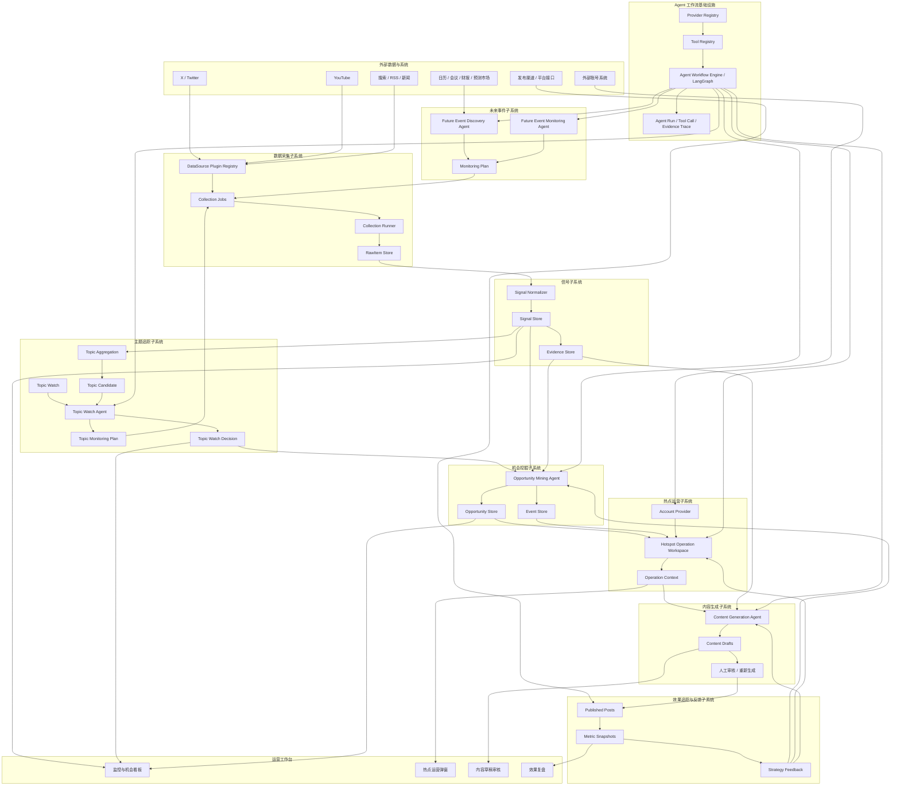

# Hotspot Monitor V2 总体架构设计

## 1. 架构结论

V2 不建议把 OpenClaw 作为系统底座。

推荐架构是：

```text
NestJS 业务系统
+ Prisma / PostgreSQL 数据层
+ Queue / Scheduler 异步任务层
+ 自研插件与 Provider 层
+ LangGraph Agent 工作流层
+ Tool Registry 工具注册层
+ 前端运营工作台
```

一句话总结：

```text
业务系统自己掌控，Agent 工作流用 LangGraph，采集和账号来源用自研插件化 Provider，OpenClaw 只作为设计参考。
```

## 2. 为什么不选 OpenClaw 作为核心架构

OpenClaw 的核心价值更偏向：

- 多聊天渠道网关。
- Agent 会话入口。
- 工具、插件、技能的统一暴露。
- 让用户从 Telegram、Slack、Discord、WhatsApp 等渠道和 Agent 交互。

但本系统的核心不是聊天网关，而是一个垂直业务系统：

```text
采集数据
→ 整理信号
→ 挖掘机会
→ 热点运营
→ 生成内容
→ 追踪效果
→ 反向优化策略
```

这些能力需要强业务数据模型、审计记录、任务状态、运营后台和可控工作流。

如果直接使用 OpenClaw 作为核心底座，可能带来几个问题：

- 业务对象容易被外部框架的会话模型牵着走。
- 数据采集、机会、任务、内容、复盘等核心模型仍然要自己实现。
- 后续系统边界会混在 Agent 网关、聊天入口和业务流程之间。
- 对本产品价值最大的部分不是 OpenClaw 的强项。

因此 OpenClaw 不作为核心依赖。

可以借鉴它的思想：

- 插件注册。
- 工具声明。
- 权限控制。
- Agent 可用能力暴露。
- 多 Agent routing。

但这些应该转化成本系统自己的轻量实现。

## 3. 为什么选 LangGraph 做 Agent 编排

本系统后续的 Agent 不是简单的一次提示词调用，而是多步决策流程：

```text
读取上下文
→ 判断缺什么数据
→ 选择工具
→ 指定字段
→ 执行工具
→ 累积证据
→ 判断是否继续
→ 输出结构化结论
→ 必要时等待人工确认
```

LangGraph 适合承载这类流程，因为它更偏底层 Agent 编排：

- 有显式状态。
- 有节点和边。
- 可插入工具调用。
- 可做条件分支。
- 可做人工确认节点。
- 可持久化执行状态。
- 可追踪每一步 Agent 做了什么。

这比单纯把规则写在 Prompt 里更可控。

推荐做法是：

```text
业务系统不直接到处依赖 LangGraph。
```

而是封装一层：

```ts
interface AgentWorkflowEngine {
  run(input: AgentRunInput): Promise<AgentRunResult>
}
```

这样未来如果要替换 Agent 编排框架，业务层不需要大改。

## 4. 系统总体分层

V2 建议拆成六层。

```text
前端运营工作台
↓
业务 API 层
↓
业务领域层
↓
Agent 工作流层
↓
插件 / Provider / Tool Registry 层
↓
数据存储与外部平台
```

更具体地说：

```text
hotspot-master
→ 运营后台

hotspot-agent-backend
→ NestJS API
→ 业务服务
→ Agent Workflow Engine
→ DataSource Plugins
→ Account Providers
→ Channel Providers
→ Prisma / PostgreSQL
→ X / YouTube / Search / 外部账号系统
```

## 5. 核心数据原则：RawItem → Signal → Evidence

V2 的第一数据原则是：

```text
所有外部数据先进入 RawItem，再标准化为 Signal；
所有 Agent 默认消费 Signal 和 Evidence；
平台原始数据只作为可追溯证据保留。
```

三者边界如下：

```text
RawItem：平台原始数据
Signal：业务可理解的标准信号
Evidence：可被 Agent 和运营人员引用的事实证据
```

### 5.1 RawItem

`RawItem` 保存平台或外部系统返回的原始数据。

它的职责是：

- 保留原始返回。
- 保留来源、采集时间和追溯信息。
- 支持后续重新解析。
- 支持审计和问题排查。

它不负责：

- 判断是否有价值。
- 判断是否形成机会。
- 判断是否分发任务。
- 生成内容。

### 5.2 Signal

`Signal` 是进入 Agent 系统前的统一抽象。

热搜、帖子、视频、未来事件监控结果、搜索结果、行业话题都可以先变成 Signal。

它回答：

```text
发生了什么值得注意？
它来自哪里？
什么时候观察到？
有哪些指标？
可以追溯到哪些 RawItem？
```

### 5.3 Evidence

`Evidence` 是从 Signal 或工具结果中沉淀出来的可引用事实。

它回答：

```text
哪个事实支撑了这个判断？
证据来自哪个来源？
证据可信度如何？
证据能否被运营人员打开查看？
```

Agent 的核心结论必须引用 Evidence，而不是只引用模型自己的判断。

### 5.4 Agent 默认输入

Agent 默认不直接消费平台原始数据。

默认输入应该是：

```text
Signal
+ Evidence
+ Tool 查询结果
+ 业务上下文
```

只有在排查、重解析或证据核验时，系统才回到 RawItem。

这条原则保证：

- 平台差异不会污染 Agent 主流程。
- Agent 的判断有证据来源。
- 原始数据可以追溯。
- 新增平台不会破坏机会挖掘、热点运营和内容生成链路。

## 6. 核心业务链路

V2 的主链路应该是：

```text
原始数据采集
→ 标准化信号
→ 未来事件发现与监控规划
→ 主题追踪与动态抓取规划
→ 机会挖掘
→ 热点运营
→ 内容生成
→ 效果追踪
→ 策略优化
```

对应系统模块：

```text
Data Collection Plugin
→ Signal Store
→ Future Event Agent
→ Topic Watch Agent
→ Opportunity Mining Agent
→ Hotspot Operation Workspace
→ Content Generation Agent
→ Performance Tracking
→ Strategy Feedback
```

架构图：



## 7. 数据采集层

数据采集层的目标是：

```text
以后接入一个新平台，只需要实现这个平台如何采集数据。
```

不应该每接一个平台都重写：

- 调度。
- 去重。
- 快照。
- 原始数据存储。
- 错误记录。
- 监控。
- 标准化。
- 后续触发。

采集能力应该抽象成插件：

```ts
interface DataSourcePlugin {
  id: string
  name: string
  platform: string
  capabilities: DataSourceCapability[]

  collect(input: CollectionInput): Promise<CollectionResult>
  normalize(raw: unknown): Promise<RawItem[]>
}
```

第一批插件：

- X 热搜榜插件。
- X 指定账号插件。
- X 主题圈账号插件。
- YouTube 视频插件。
- 搜索 / RSS / 官方页面插件。

未来事件本身不建议只做成一个采集插件。它应该由 Future Event Agent 判断未来事件是否值得关注，并生成监控计划，再由具体数据采集插件执行。

采集层只负责产出：

```text
RawItem
Signal
```

不负责判断机会，不负责生成任务，不负责内容生产。

详细设计见：

```text
docs/hotspot-v2/DATA_COLLECTION_PLUGIN_ARCHITECTURE.md
```

## 8. 信号层

Signal 是不同来源数据进入 Agent 系统前的统一抽象，由 RawItem 标准化生成。

热搜、帖子、视频、未来事件监控结果、搜索结果、行业话题都可以先变成 Signal。

```ts
interface Signal {
  id: string
  source: string
  platform: string
  signalType:
    | 'trend'
    | 'post'
    | 'video'
    | 'topic'
    | 'future_event'
    | 'search_result'
    | 'external_item'

  title: string
  summary?: string
  observedAt: string
  rawRefs: string[]
  metrics?: Record<string, number | null>
  metadata?: Record<string, unknown>
}
```

Signal 层的价值是：

- 屏蔽不同平台原始数据差异。
- 给 Agent 一个统一入口。
- 支持跨平台机会挖掘。
- 保留原始证据引用。
- 为 Evidence 抽取提供稳定输入。

## 9. 未来事件层

未来事件不是普通数据源。

它的价值是：

```text
提前发现未来可能值得运营关注的事件
并规划事件前、中、后的监控策略
```

推荐拆成两个 Agent：

```text
Future Event Discovery Agent
+ Future Event Monitoring Agent
```

分别负责：

- 发现未来事件候选。
- 判断事件是否值得进入监控。
- 生成监控关键词、账号、平台、频率和阶段。
- 输出 MonitoringPlan。
- 让数据采集插件按计划执行采集。

未来事件层不负责直接生成内容任务，也不负责直接发布。

它的输出会进入后续链路：

```text
FutureEvent
→ MonitoringPlan
→ DataSource Plugin
→ Signal
→ Opportunity Mining Agent
```

详细设计见：

```text
docs/hotspot-v2/FUTURE_EVENT_AGENT_ARCHITECTURE.md
```

## 10. 主题追踪层

主题追踪不是固定关键词和固定账号轮询。

它应该设计成：

```text
Topic Watch Agent
```

主题追踪层负责：

- 接收运营人员定义的主题关注规则。
- 理解采集策略、触发策略和证据要求。
- 生成 Topic Monitoring Plan。
- 指定应该抓取的平台、关键词、账号、频率和字段。
- 将主题下大量账号帖子和相关 Signal 先聚合成 Topic Candidate。
- 基于 Topic Candidate 和证据包进行判断。
- 判断是否继续观察、调整监控计划、创建机会或请求人工复核。

主题追踪层和机会挖掘层的边界是：

```text
DataSource Plugin：负责抓取账号帖子、搜索结果、视频等原始数据。
Signal Store：负责保存标准化信号。
Topic Aggregation：负责把大量帖子和信号聚合成候选话题。
Topic Watch Agent：判断主题应该看什么、候选话题是否有触发迹象。
Opportunity Mining Agent：判断这些迹象是否构成内容机会或事实事件。
```

大量原始数据不直接进入 Agent。

Agent 处理的是：

```text
Topic Candidate
+ representativeSignals
+ evidenceRefs
+ metrics
```

详细设计见：

```text
docs/hotspot-v2/TOPIC_WATCH_AGENT_ARCHITECTURE.md
```

## 11. 机会挖掘层

机会挖掘层不应该继续做固定规则判断。

它应该变成：

```text
Opportunity Mining Agent
```

输入：

```text
一个或多个 Signal
+ 目标说明
+ 可用工具
+ 预算和约束
```

输出：

```text
OpportunityCandidate
Event
Insight
Ignore Reason
Human Review Request
```

它的核心能力是：

- 根据目标判断需要哪些数据。
- 按需调用工具。
- 按需选择字段。
- 累积证据。
- 判断是否有内容机会。
- 判断是否应该创建 Event。
- 判断是否需要人工复核。

详细设计见：

```text
docs/hotspot-v2/OPPORTUNITY_MINING_AGENT_WORKFLOW_ARCHITECTURE.md
```

## 12. 热点运营层

新系统不再设计独立的“任务分发层”，也不再把 Event 自动拆成一组账号任务。

热点形成之后，系统提供的是一个围绕 Event / Opportunity 的运营工作区：

```text
Event / Opportunity
→ 热点运营工作区
→ 获取可用运营账号
→ 展示账号人设、内容规则和历史表现
→ 运营选择承接账号和角度
→ 生成候选内容
→ 人工发布并回填链接
→ 进入效果追踪
```

账号来源仍然通过 Provider 抽象：

```ts
interface AccountProvider {
  id: string
  source: 'local' | 'external'
  listAccounts(query: AccountQuery): Promise<OperatingAccount[]>
  getAccount(accountId: string): Promise<OperatingAccount | null>
}
```

这样账号可以来自：

- 本地系统。
- 外部账号系统。
- 运营中台。
- 后续平台接口。

热点运营层只负责组织运营上下文：

```text
当前热点是什么
有哪些事实依据
有哪些账号可承接
每个账号的人设和内容规则是什么
已经生成了哪些候选
哪些发布链接已经回填
后续效果追踪状态如何
```

系统可以用 Agent 辅助推荐承接账号和角度，但这个能力只是热点运营工作区里的建议能力，不再作为独立的任务分发业务存在。

这样可以避免系统变成一个下游任务派发工具。内容运营的入口始终围绕热点本身，而不是围绕任务列表。

## 13. 内容生成层

内容生成层接收热点运营层整理出的运营上下文。

输入不应该只有事件文本，而应该包含：

- 事件上下文。
- 证据引用。
- 账号人设。
- 内容规则。
- 内容目标。
- 承接角度。
- 禁止表达。
- 平台格式约束。

```ts
interface ContentGenerationInput {
  targetId: string
  accountId: string
  accountPersona: string
  contentRules: string
  contentGoal: string
  angle: string
  constraints: string[]
  evidenceRefs: string[]
}
```

内容生成 Agent 的职责是：

- 根据热点运营上下文生成草稿。
- 支持运营人员追加要求后重新生成。
- 保留引用证据。
- 区分事实和观点。
- 遵守账号和平台约束。

它不负责判断这个事件值不值得做，也不负责替运营人员创建分发任务。

## 14. 效果追踪层

发布后需要追踪回填链接的效果。

效果追踪层负责：

- 抓取帖子指标。
- 记录点赞、回复、转发、引用、浏览量。
- 按规则调整追踪频率和追踪期限。
- 标记表现良好内容。
- 将效果反馈给机会挖掘、热点运营和内容生成策略。

追踪数据可以反向优化：

- 什么类型信号更容易形成好内容。
- 哪些账号适合哪些主题。
- 哪些承接角度表现更好。
- 哪些内容生成规则需要调整。

## 15. Tool Registry

Agent 不应该直接访问数据库或任意外部接口。

所有能力都应该通过 Tool Registry 暴露。

```ts
interface AgentToolDefinition {
  name: string
  description: string
  inputSchema: JsonSchema
  outputSchema: JsonSchema
  permissions: ToolPermission
  limits: ToolLimits
}
```

Agent 调用路径：

```text
Agent
→ Tool Registry
→ Tool Executor
→ 业务服务
→ 数据库 / 外部系统
```

这样可以控制：

- 哪些工具可用。
- 哪些字段可取。
- 最多调用几次。
- 能不能写数据。
- 能不能访问外部系统。
- 每一步如何审计。

## 16. Provider Registry

Provider Registry 负责管理外部能力来源。

主要 Provider：

```text
DataSourceProvider
AccountProvider
ChannelProvider
SearchProvider
ModelProvider
MetricProvider
```

Provider 和 Tool 的关系：

```text
Provider 提供底层能力
Tool 把能力包装成 Agent 可理解的动作
Agent 只看 Tool，不直接看 Provider
```

例如：

```text
LocalAccountProvider
ExternalAccountProvider
→ accounts.listAvailable 工具
→ 热点运营工作区调用
```

## 17. Agent 运行记录

所有 Agent 都应该记录运行过程，而不是只记录最终结果。

建议统一记录：

```text
agent_runs
agent_run_steps
agent_tool_calls
agent_evidence_items
agent_decisions
```

每次运行需要记录：

- 输入目标。
- 可用工具。
- 每次工具调用。
- 工具输入输出。
- 中间证据。
- 最终决策。
- 缺失数据。
- 风险说明。
- 人工确认结果。

这样后续才能：

- 调试 Agent。
- 复盘错误判断。
- 优化提示词。
- 优化工具。
- 做评估集。

## 18. 人工确认机制

V2 不应该一开始追求全自动。

建议把 Agent 的动作分为三类：

### 18.1 只读分析

允许自动执行。

例如：

- 查询帖子。
- 查询相似机会。
- 查询账号人设。
- 查询历史发布与历史候选。

### 18.2 建议型写入

默认需要人工确认。

例如：

- 创建机会。
- 创建事件。
- 生成内容 brief。

### 18.3 高风险动作

必须人工确认。

例如：

- 发布内容。
- 修改账号配置。
- 修改工作流。
- 调用外部系统创建正式任务。

MVP 建议：

```text
Agent 只自动执行读操作。
所有写操作先变成建议。
运营人员确认后再落库。
```

## 19. 技术组件选型

### 19.1 后端

推荐使用：

```text
NestJS
```

原因：

- 适合组织业务模块。
- 适合做 API、服务、依赖注入、定时任务。
- 适合封装 Agent Workflow Engine。

### 19.2 数据库

推荐：

```text
PostgreSQL + Prisma
```

原因：

- 业务数据强结构化。
- 需要审计、关联、查询和复盘。
- JSON 字段可以承载工具输入输出和原始数据。

### 19.3 异步任务

推荐：

```text
BullMQ / Temporal 二选一
```

MVP 可以使用 BullMQ。

如果后续 Agent 流程变得很长、需要大量恢复和补偿，可以考虑 Temporal。

### 19.4 Agent 编排

推荐：

```text
LangGraph
```

使用方式：

```text
只在 Agent Workflow Engine 内部使用
业务层不直接依赖 LangGraph
```

### 19.5 LLM 工具封装

可以少量使用：

```text
LangChain
```

但不要把业务逻辑写成 LangChain chain。

LangChain 主要用于：

- 模型适配。
- Tool schema。
- 结构化输出。
- 少量通用工具封装。

### 19.6 OpenClaw

不引入核心系统。

只作为参考：

- 插件思想。
- 工具策略。
- Agent workspace。
- 多 Agent routing。

## 20. 推荐模块结构

后端推荐模块结构：

```text
src/
  data-source/
    plugins/
    providers/
    collection-runner.ts
    signal-normalizer.ts

  signal/
    signal.service.ts
    signal.repository.ts

  future-event/
    future-event-discovery-agent.service.ts
    future-event-monitoring-agent.service.ts
    future-event-plan.service.ts
    future-event.repository.ts

  topic-watch/
    topic-watch-agent.service.ts
    topic-aggregation.service.ts
    topic-monitoring-plan.service.ts
    topic-watch-decision.service.ts
    topic-watch.repository.ts

  opportunity/
    opportunity.service.ts
    opportunity.repository.ts

  assignment/
    assignment-agent.service.ts
    account-provider.registry.ts
    assignment-decision.service.ts

  content/
    content-generation-agent.service.ts
    content-draft.service.ts

  performance/
    performance-tracking.service.ts
    performance-feedback.service.ts

  agent/
    workflow-engine/
    tool-registry/
    run-log/
    evidence/

  integrations/
    x/
    youtube/
    search/
    external-account/
```

## 21. 推荐建设路线

### 阶段一：领域模型与基础设施

先定义新系统的核心对象和基础设施：

- RawItem。
- Signal。
- FutureEvent。
- TopicWatch。
- Opportunity。
- Event。
- Evidence。
- OperationContext。
- ContentDraft。
- AgentRun。
- Tool Registry。
- Provider Registry。

### 阶段二：数据采集插件化

先把采集能力抽成 DataSource Plugin。

目标：

```text
新增一个平台时，只写采集插件。
```

### 阶段三：未来事件 Agent

先支持人工录入或外部同步 FutureEvent。

Future Event Monitoring Agent 生成监控计划。

人工确认后，由数据采集插件按计划执行。

目标：

```text
未来事件不直接变成内容任务，而是先变成可监控、可追踪、可进入机会挖掘的 Signal。
```

### 阶段四：主题追踪 Agent

支持运营人员定义 TopicWatch。

Topic Watch Agent 根据主题规则生成监控计划。

人工确认后，由数据采集插件按计划执行。

目标：

```text
不同主题可以使用不同采集规则、触发规则和证据标准。
```

### 阶段五：机会挖掘 Agent

Agent 输出机会判断。

前端展示：

```text
Agent 结果
证据引用
缺失数据
风险说明
人工判断
```

### 阶段六：热点运营工作区

运营在 Event 详情中打开热点运营弹窗。

系统在同一上下文里展示账号、候选内容、发布回填和追踪状态。

### 阶段七：内容生成 Agent

内容生成基于 Event / Opportunity、证据上下文、账号人设和运营补充要求。

不再提前生成大量候选。

### 阶段八：效果反馈闭环

把发布表现回流到：

- 机会判断。
- 账号分发。
- 内容角度。
- 生成规则。

### 阶段九：半自动化

只对高置信度、低风险场景自动执行。

高风险动作仍然人工确认。

## 22. 核心表设计方向

V2 不一定要立刻建所有表，但方向应该清楚。

建议核心表分为：

```text
raw_items
signals
future_event_candidates
future_events
future_event_monitoring_plans
future_event_monitoring_runs
topic_watches
topic_monitoring_plans
topic_monitoring_runs
topic_aggregation_runs
topic_candidates
topic_watch_decisions
opportunities
events
evidence_items
agent_runs
agent_run_steps
content_drafts
published_posts
post_metric_snapshots
provider_configs
tool_definitions
```

其中：

- `raw_items` 存原始采集结果。
- `signals` 存标准化信号。
- `future_event_candidates` 存未来事件候选。
- `future_events` 存确认后的未来事件。
- `future_event_monitoring_plans` 存未来事件监控计划。
- `future_event_monitoring_runs` 存未来事件监控执行记录。
- `topic_watches` 存主题追踪定义。
- `topic_monitoring_plans` 存主题监控计划。
- `topic_monitoring_runs` 存主题监控执行记录。
- `topic_aggregation_runs` 存主题聚合执行记录。
- `topic_candidates` 存主题候选话题。
- `topic_watch_decisions` 存主题触发判断。
- `opportunities` 存挖掘出的内容机会。
- `events` 存事实性事件。
- `evidence_items` 存可引用证据。
- `agent_runs` 存 Agent 运行。
- `content_drafts` 存候选内容。
- `published_posts` 存回填发布链接。
- `post_metric_snapshots` 存效果追踪。

## 23. 安全与治理

Agent 系统必须有治理边界。

必须控制：

- 工具白名单。
- 数据访问范围。
- 字段访问范围。
- 单次运行预算。
- 工具调用次数。
- 外部接口访问权限。
- 写操作审批。
- 发布审批。
- 工作流版本。
- Prompt 版本。
- Agent 输出 schema。

必须记录：

- 谁触发了 Agent。
- Agent 看到了什么输入。
- Agent 调用了什么工具。
- 工具返回了什么。
- Agent 为什么做这个判断。
- 人工是否确认。
- 最终是否产生业务动作。

## 24. 未来是否需要 OpenClaw

新系统不需要。

未来只有在以下场景出现时，才重新评估：

- 需要把系统 Agent 暴露到 Telegram、Slack、Discord 等聊天渠道。
- 需要一个统一的多渠道 Agent Gateway。
- 需要接入 OpenClaw 的插件生态作为外部工具来源。
- 需要让运营人员直接在聊天工具里操作系统。

即使未来使用，也建议作为外围入口：

```text
OpenClaw
→ 调用本系统 API
→ 本系统执行业务逻辑
```

而不是：

```text
本系统核心业务运行在 OpenClaw 内部
```

## 25. 最终推荐

最终推荐架构：

```text
前端：
  React + Ant Design

后端：
  NestJS

数据库：
  PostgreSQL + Prisma

异步任务：
  BullMQ 起步，复杂后评估 Temporal

Agent 编排：
  LangGraph

Agent 工具：
  自研 Tool Registry

数据源扩展：
  自研 DataSource Plugin

未来事件：
  Future Event Discovery Agent + Future Event Monitoring Agent

主题追踪：
  Topic Watch Agent

账号来源扩展：
  自研 Account Provider

渠道扩展：
  自研 Channel Provider

OpenClaw：
  不引入核心系统，仅作为插件和工具设计参考
```

核心原则：

```text
数据可追溯
工具受控制
Agent 可审计
动作可确认
模块可替换
平台可扩展
```

这套架构可以支撑系统从“热点任务发布工具”升级为：

```text
面向运营的内容机会发现与决策 Agent 平台
```
