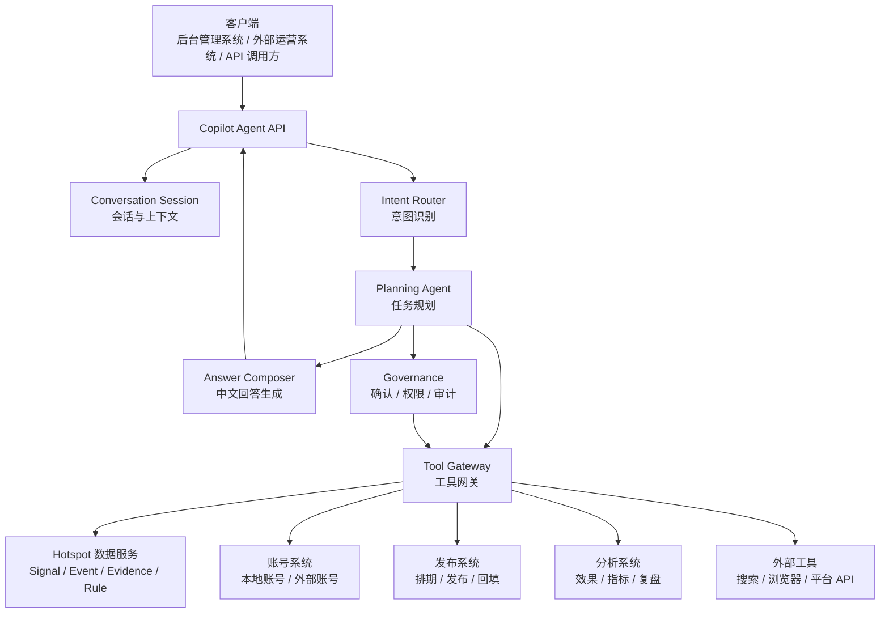

# System Copilot Agent 逻辑独立服务架构设计

## 1. 定位

`System Copilot Agent` 是当前后端内逻辑独立的智能运营 Agent 服务。

它不是某个后台页面里的聊天组件，也不是几个固定接口的自然语言包装，而是一个可以被多个系统调用的智能协作层。

它要解决的问题是：

```text
运营人员用自然语言表达目标
→ Agent 自己判断需要哪些数据、哪些工具、哪些规则
→ 系统在受控边界内执行查询、分析、配置草稿和确认后的变更
→ 返回可理解、可追溯、可执行的中文结论
```

当前后台只是它的第一个客户端。未来账号系统、发布系统、分析系统、内容系统、外部运营工具都可以通过 API 接入它。

## 2. 为什么要独立成服务

如果 AI 助手继续放在某个业务后端里，会出现几个问题：

- 它会被当前页面和当前业务表结构绑定。
- 工具会越写越像 Controller 的包装。
- 新系统接入时必须改原后端。
- 权限、确认、审计、记忆、工具注册会散落在业务代码里。
- Agent 的运行日志和业务日志混在一起，后期很难诊断。

逻辑独立服务的目标是让 Agent 只依赖标准协议：

```text
用户问题
上下文
可用工具
权限策略
工具结果
确认记录
```

它不直接拥有所有业务数据，也不直接绕过业务系统写库。

## 3. 总体架构



核心链路：

```text
用户输入
→ 意图识别
→ Agent 规划
→ 工具选择
→ 工具执行
→ 证据整理
→ 必要时继续规划
→ 生成结论或待确认操作
→ 用户确认后执行写操作
→ 审计记录
```

## 4. 服务边界

### 4.1 Copilot Agent Service 负责什么

- 接收自然语言请求。
- 管理会话上下文。
- 判断用户意图。
- 调度一个或多个 Agent。
- 选择和调用工具。
- 汇总工具结果。
- 生成中文回答。
- 生成配置修改草稿。
- 管理待确认操作。
- 用户确认后执行受控写操作。
- 记录 Agent Run、工具调用、确认记录和审计日志。
- 管理可用工具、权限、成本和调用限制。

### 4.2 Copilot Agent Service 不负责什么

- 不直接抓取所有平台数据。
- 不直接拥有所有业务表。
- 不绕过业务系统写库。
- 不替代账号系统、发布系统、数据采集系统。
- 不把模型输出当作最终事实。

业务事实必须来自工具结果。

写操作必须通过业务系统提供的受控工具执行。

## 5. 核心子系统

### 5.1 Copilot API

对外提供统一接口。

建议接口：

```text
POST /copilot/chat
POST /copilot/actions/{actionId}/confirm
POST /copilot/actions/{actionId}/reject
GET  /copilot/tools
```

`chat` 请求示例：

```json
{
  "sessionId": "sess_123",
  "userId": "user_1",
  "tenantId": "tenant_1",
  "message": "预测市场行业添加监控账号 @Jason",
  "context": {
    "client": "hotspot-admin",
    "page": "settings",
    "projectId": "hotspot"
  }
}
```

### 5.2 Intent Router

先判断问题类型，避免 Agent 随便查错方向。

基础意图：

```text
config_read           查看配置
config_edit           编辑配置
data_query            查询数据
diagnosis             诊断问题
aggregation_analysis  聚合分析
rule_edit             修改规则
content_help          内容辅助
system_operation      执行系统操作
unknown               无法判断
```

意图识别不应该完全靠正则，也不应该完全靠模型。

推荐方式：

```text
轻量确定性规则
+ LLM 分类
+ 上下文修正
+ 工具可用性约束
```

比如：

```text
“预测市场行业添加监控账号 @Jason”
→ config_edit
→ 首选工具 topicWatch.list / account.profile.lookup
→ 最终输出待确认操作
```

不能直接跑最近 Signal 查询。

### 5.3 Planning Agent

`Planning Agent` 决定这次任务怎么做。

它的职责：

- 判断需要哪些数据。
- 选择工具。
- 指定工具参数。
- 指定需要哪些字段。
- 判断工具结果是否足够。
- 必要时继续调用工具。
- 生成最终回答或待确认操作。

它输出的不是自由文本，而是结构化步骤：

```json
{
  "type": "tool_call",
  "toolName": "topicWatch.list",
  "reason": "需要找到名称为预测市场行业的主题配置",
  "arguments": {
    "query": "预测市场行业"
  },
  "requestedFields": ["id", "name", "accounts", "triggerPolicy"]
}
```

最终输出：

```json
{
  "type": "final_decision",
  "decision": {
    "message": "我找到了“预测市场行业”主题，准备添加 @Jason。来源角色和单点权限建议如下，请确认后应用。",
    "proposedActions": [
      {
        "tool": "topicWatch.account.add",
        "summary": "给预测市场行业添加监控账号 @Jason",
        "arguments": {
          "topicWatchId": "topic_prediction_market",
          "handle": "Jason",
          "primaryRole": "行业观察账号",
          "singleTriggerPolicy": "C",
          "authorityScope": "仅作为预测市场行业讨论来源，不单独触发第一方确认"
        },
        "requiresConfirmation": true
      }
    ],
    "usedTools": ["topicWatch.list"],
    "missingData": [],
    "suggestedNextSteps": []
  }
}
```

### 5.4 Tool Gateway

`Tool Gateway` 是 Agent 与业务系统之间的唯一通道。

每个工具必须声明：

- 名称。
- 描述。
- 输入 schema。
- 输出 schema。
- 权限级别。
- 是否需要确认。
- 成本等级。
- 超时限制。
- 调用次数限制。
- 所属系统。

工具定义示例：

```ts
interface CopilotToolDefinition {
  name: string
  description: string
  ownerService: string
  permission: 'read' | 'suggest_write' | 'confirmed_write' | 'high_risk'
  inputSchema: JsonSchema
  outputSchema: JsonSchema
  fieldSelection?: {
    supported: boolean
    allowedFields: string[]
    defaultFields: string[]
  }
  limits: {
    maxCallsPerRun: number
    timeoutMs: number
    costLevel: 'low' | 'medium' | 'high'
  }
}
```

工具调用不等于直接执行业务逻辑。

写操作要分两步：

```text
Agent 生成 proposedAction
→ 用户确认
→ Governance 校验权限
→ Tool Gateway 执行写工具
→ 记录审计日志
```

### 5.5 Governance

治理层负责安全边界。

它需要处理：

- 用户是否有权限调用某工具。
- 当前租户是否能访问目标资源。
- 写操作是否需要确认。
- 高风险操作是否需要二次审批。
- Agent 输出的参数是否符合 schema。
- 是否命中调用频率限制。
- 是否需要记录变更前后 diff。
- 是否允许回滚。

写操作永远不能只靠模型一句话直接执行。

### 5.6 Memory 与 Context

Agent 需要记住的是“协作上下文”，不是无边界聊天记录。

建议分三类：

```text
Session Memory      当前会话上下文
Project Memory      项目偏好、业务目标、常用规则
Operation Memory    历史配置变更、确认记录、决策理由
```

示例：

- 用户偏好中文回答。
- 当前项目关注预测市场、Web3、金融、AI。
- 运营规则要求写操作必须确认。
- 某个主题上次添加账号时采用了 C 类单点权限。

## 6. 工具体系设计

### 6.1 配置类工具

```text
topicWatch.list
topicWatch.get
topicWatch.proposeUpdate
topicWatch.account.add
topicWatch.account.remove
topicWatch.account.update
rulePack.list
rulePack.get
rulePack.proposeEdit
collectionConfig.get
collectionConfig.proposeUpdate
```

配置类工具用于回答：

- 我现在配置了哪些主题？
- 某个主题有哪些监控账号？
- 帮我给某主题添加账号。
- 根据规则帮我补全账号角色。
- 修改这个规则包，但不要覆盖原文。

### 6.2 数据查询工具

```text
signal.search
signal.getRecent
signal.getById
event.search
event.getContext
evidence.search
opportunity.search
topicCandidate.search
futureEvent.search
youtubeBreakout.search
```

数据查询工具用于回答：

- 最近有哪些信号？
- 某个事件的证据是什么？
- 为什么某个主题没有形成事件？
- 最近哪些 YouTube 视频值得拆解？

### 6.3 分析工具

```text
analysis.aggregateSignals
analysis.diagnoseTopicWatch
analysis.compareEvents
analysis.summarizeEvidence
analysis.findProductAngles
analysis.detectDuplicates
```

分析工具可以是普通代码，也可以是 Agent 子流程。

原则：

```text
稳定、可重复、低成本的计算用代码
开放、需要语义判断的分析用 Agent
```

### 6.4 外部系统工具

```text
externalAccounts.list
externalAccounts.getProfile
externalPublisher.schedule
externalPublisher.getStatus
externalAnalytics.getPostPerformance
browser.fetchPage
browser.extractContent
search.web
```

外部系统通过 Tool Gateway 注册工具，Copilot 不直接依赖它们的代码。

## 7. 典型业务流程

### 7.1 查询配置

用户：

```text
我现在主题圈配置了哪些主题？
```

流程：

```text
Intent Router → config_read
Planning Agent → 调用 topicWatch.list
Tool Gateway → 返回主题配置
Answer Composer → 输出中文摘要
```

正确回答应包含：

- 主题名称。
- 启用状态。
- 监控账号数量。
- 主要账号。
- 规则或证据要求的简短摘要。

### 7.2 编辑配置

用户：

```text
预测市场行业添加监控账号 @Jason
```

流程：

```text
Intent Router → config_edit
Planning Agent → 调用 topicWatch.list 查主题
Planning Agent → 可选调用 externalAccounts.getProfile 查账号信息
Planning Agent → 根据主题规则补全 primaryRole / singleTriggerPolicy / authorityScope
Planning Agent → 生成 proposedAction
用户确认
Governance → 校验权限和参数
Tool Gateway → 执行 topicWatch.account.add
Audit Log → 记录变更
```

如果账号资料不足，Agent 不能胡说。

它应该输出：

```text
我能添加这个账号，但无法确认它是否是第一方权威账号。
建议先按“行业观察账号”加入，单点权限为 C，不允许单独触发事件。
```

### 7.3 诊断问题

用户：

```text
为什么主题追踪一直没有形成事件？
```

流程：

```text
Intent Router → diagnosis
Planning Agent → 查主题配置
Planning Agent → 查最近采集记录
Planning Agent → 查 Topic Candidate
Planning Agent → 查 Agent Run 日志
Planning Agent → 查事件表
Answer Composer → 按链路说明卡在哪里
```

回答结构：

```text
结论
证据
链路状态
可能原因
建议下一步
```

### 7.4 聚合分析

用户：

```text
帮我看最近有哪些值得运营的热点。
```

流程：

```text
Intent Router → aggregation_analysis
Planning Agent → 查最近 Signal / Event / Topic Candidate / YouTube Breakout / Future Event
分析工具 → 去重、聚类、排序
Agent → 给出机会判断、承接角度、内容窗口
```

输出不是任务列表，而是运营机会：

- 机会标题。
- 为什么现在值得看。
- 证据来源。
- 产品承接角度。
- 风险和缺失数据。

## 8. 多 Agent 协作

独立 Copilot 不应该只有一个大 Agent 负责所有事情。

推荐分成：

```text
Copilot Orchestrator Agent   总调度
Config Agent                 配置查询与修改草稿
Data Analyst Agent           数据查询和诊断
Rule Editor Agent            规则修改和测试建议
Opportunity Analyst Agent    热点机会分析
Content Strategy Agent       内容角度和表达建议
```

`Copilot Orchestrator Agent` 负责：

- 判断要不要交给子 Agent。
- 合并多个子 Agent 的结果。
- 控制工具调用预算。
- 统一输出给用户。

子 Agent 只负责自己的专业问题。

这样可以避免一个 Agent 同时处理配置、数据、内容、权限，导致行为发散。

## 9. 运行记录与可观测性

每一次 Agent 执行都要记录：

```text
runId
sessionId
userId
tenantId
intent
goal
model
toolsAvailable
toolCalls
toolResults摘要
finalDecision
proposedActions
confirmedActions
error
tokenUsage
startedAt
finishedAt
```

需要提供后台查看：

- Agent 为什么调用这个工具？
- 哪一步拿到了什么数据？
- 为什么给出这个建议？
- 哪个操作被用户确认了？
- 写操作改了什么？

这对调试“AI 助手太傻”非常重要。

不能只看最终回答。

## 10. API 协议草案

### 10.1 Chat

```http
POST /copilot/chat
```

请求：

```json
{
  "sessionId": "sess_123",
  "tenantId": "tenant_1",
  "userId": "user_1",
  "message": "预测市场行业添加监控账号 @Jason",
  "context": {
    "client": "hotspot-admin",
    "page": "settings",
    "projectId": "hotspot"
  }
}
```

响应：

```json
{
  "message": "我找到了“预测市场行业”主题，建议把 @Jason 作为行业观察账号加入，单点权限为 C。请确认后应用。",
  "runId": "run_123",
  "proposedActions": [
    {
      "id": "act_123",
      "summary": "给预测市场行业添加监控账号 @Jason",
      "tool": "topicWatch.account.add",
      "arguments": {
        "topicWatchId": "topic_prediction_market",
        "handle": "Jason",
        "primaryRole": "行业观察账号",
        "singleTriggerPolicy": "C",
        "authorityScope": "用于补充预测市场行业讨论，不单独形成第一方确认"
      },
      "requiresConfirmation": true
    }
  ],
  "missingData": [],
  "usedTools": ["topicWatch.list"]
}
```

### 10.2 Confirm Action

```http
POST /copilot/actions/act_123/confirm
```

请求：

```json
{
  "confirmedBy": "user_1"
}
```

响应：

```json
{
  "status": "succeeded",
  "message": "已添加监控账号 @Jason。",
  "auditId": "audit_123"
}
```

## 11. 数据模型草案

### 11.1 ConversationSession

```text
id
tenantId
userId
client
title
status
createdAt
updatedAt
```

### 11.2 CopilotMessage

```text
id
sessionId
role
content
metadata
createdAt
```

### 11.3 AgentRun

```text
id
sessionId
tenantId
userId
intent
goal
status
model
result
errorMessage
startedAt
finishedAt
createdAt
updatedAt
```

### 11.4 AgentToolCall

```text
id
runId
toolName
arguments
requestedFields
resultSummary
status
errorMessage
startedAt
finishedAt
```

### 11.5 ProposedAction

```text
id
runId
sessionId
toolName
summary
arguments
status
requiresConfirmation
createdByAgent
confirmedBy
confirmedAt
executedAt
result
errorMessage
```

### 11.6 ToolRegistration

```text
id
name
ownerService
description
permission
inputSchema
outputSchema
endpoint
authPolicy
status
createdAt
updatedAt
```

## 12. 权限设计

权限至少分四级：

```text
read             只读查询，可直接执行
suggest_write    只能生成待确认操作
confirmed_write  用户确认后可执行
high_risk        需要二次审批或管理员权限
```

示例：

```text
topicWatch.list              read
signal.search                read
rulePack.proposeEdit         suggest_write
topicWatch.account.add       confirmed_write
collectionConfig.update      confirmed_write
deleteProject                high_risk
```

## 13. 错误处理

Agent 服务需要把错误分清楚：

```text
USER_INPUT_INCOMPLETE       用户输入不足
TOOL_ARGUMENT_INVALID       工具参数错误
TOOL_NOT_FOUND              工具不存在
TOOL_PERMISSION_DENIED      没权限
TOOL_EXECUTION_FAILED       工具执行失败
MODEL_OUTPUT_INVALID        模型输出不合法
AGENT_STEP_BUDGET_EXCEEDED  Agent 步数超限
ACTION_CONFIRM_REQUIRED     需要用户确认
```

错误不能只返回 500。

回答应该能告诉运营人员：

```text
我没有执行成功，因为没有找到“预测市场行业”这个主题。
你当前配置的相似主题有：预测市场、Crypto 与 Web3。
```

## 14. 与业务系统的集成方式

业务系统接入 Copilot 的方式不是把数据库暴露给 Agent，而是注册工具。

接入方需要提供：

```text
工具名称
工具描述
输入输出 schema
权限级别
执行 endpoint
认证方式
字段选择能力
调用限制
```

示例：

```json
{
  "name": "topicWatch.account.add",
  "ownerService": "hotspot-v2",
  "description": "给某个主题追踪配置添加监控账号",
  "permission": "confirmed_write",
  "endpoint": "https://hotspot-v2.internal/tools/topic-watch/account/add",
  "inputSchema": {
    "type": "object",
    "required": ["topicWatchId", "handle"],
    "properties": {
      "topicWatchId": { "type": "string" },
      "handle": { "type": "string" },
      "primaryRole": { "type": "string" },
      "singleTriggerPolicy": { "type": "string" },
      "authorityScope": { "type": "string" }
    }
  }
}
```

## 15. 技术选型建议

推荐技术栈：

```text
NestJS                    服务框架
LangGraph                 多步 Agent 编排
PostgreSQL + Prisma       会话、运行、工具、审计记录
Redis / Queue             长任务、异步工具调用
OpenAI Responses API      模型调用
JSON Schema / Zod         工具参数校验
OpenTelemetry             链路追踪
```

为什么选 LangGraph：

- 适合多步 Agent Loop。
- 能表达规划、工具调用、确认、继续执行。
- 状态可控，方便审计。
- 比简单 LangChain Chain 更适合复杂业务流程。

为什么不直接接 OpenClaw：

- OpenClaw 更偏通用网页操作和开放式数据获取。
- 当前核心问题是系统内工具治理、配置编辑、业务分析和审计。
- 可以把浏览器能力作为工具接入，但不应该让它成为系统主架构。

## 16. 分阶段实施计划

### 阶段一：逻辑独立 Copilot API 骨架

目标：

- 在当前 `hotspot-v2-backend` 内新增 `copilot` 模块。
- 建立会话、Agent Run、Tool Call、Proposed Action、Audit Log 表。
- 提供 `/copilot/chat` 和 `/copilot/actions/{id}/confirm`。
- 实现 Tool Registry 和 Tool Gateway。

验收：

- 可以注册 mock 工具。
- Agent 能调用只读工具回答问题。
- 写操作会生成待确认操作，不会直接执行。

### 阶段二：接入 Hotspot V2 工具

目标：

- 接入主题圈配置工具。
- 接入 Signal / Event / Evidence 查询工具。
- 接入规则包读取和修改草稿工具。
- 接入采集状态查询工具。

验收：

- 能回答“我配置了哪些主题圈”。
- 能处理“给某主题添加监控账号”。
- 能诊断“为什么没有形成事件”。
- 能解释“某个事件的证据链是什么”。

### 阶段三：配置补全与规则建议

目标：

- 添加 Config Agent。
- 根据现有规则和账号资料补全角色、单点权限、证据要求。
- 修改配置前生成 diff。
- 用户确认后执行。

验收：

- 用户只说“添加 @Jason”，Agent 能给出合理补全建议。
- 不确定的信息会标记待确认。
- 所有变更可审计、可回滚。

### 阶段四：聚合分析与诊断

目标：

- 添加 Data Analyst Agent。
- 支持多工具、多步查询。
- 支持热点聚合、事件去重、主题诊断、证据摘要。

验收：

- 能回答“最近有哪些值得运营的热点”。
- 能解释“为什么某个主题候选很多但没有形成事件”。
- 能对多个事件做去重和合并建议。

### 阶段五：外部系统接入

目标：

- 支持外部系统动态注册工具。
- 支持租户级权限。
- 支持外部账号系统、发布系统、分析系统。

验收：

- 第三方系统可通过 Tool Gateway 接入。
- Copilot 能跨系统查询和生成待确认操作。
- 不需要改 Copilot 核心代码即可接入新工具。

## 17. MVP 范围

第一版不要做太大。

MVP 只做：

- 逻辑独立 Copilot API 骨架。
- 会话接口。
- 工具注册。
- 只读工具调用。
- 待确认写操作。
- Hotspot V2 的主题圈配置工具。
- Signal / Event / Evidence 查询工具。
- Agent Run 日志。

暂不做：

- 多租户复杂权限。
- 外部系统动态 OAuth。
- 长期记忆自动学习。
- 自动执行高风险操作。
- 完整浏览器自动化。

## 18. 关键设计原则

1. Agent 负责理解和规划，不直接拥有业务事实。
2. 工具负责取数和执行，所有工具必须声明权限和 schema。
3. 写操作必须确认。
4. 所有事实来自工具结果。
5. 所有 Agent Run 可审计。
6. 新业务系统通过工具接入，不改 Agent 核心。
7. 规则、配置、数据、分析要分层。
8. 模型可以补全建议，但不能伪造确定事实。
9. 当前后台只是客户端，不是 Agent 的能力边界。
10. 服务先做可控，再做聪明。

## 19. 推荐结论

选择方案 C 是合理的。

新的 AI 助手应该直接拆成独立的 `System Copilot Agent Service`。

它的价值不是替用户点按钮，而是成为系统级智能协作入口：

```text
能查配置
能改配置草稿
能补全建议
能查信号和事件
能诊断链路
能聚合分析
能调用外部系统
能记录为什么这么做
能在用户确认后安全执行
```

这套架构会比继续在当前后端里补正则和接口更稳，也更符合后续作为独立 Agent 服务对外开放的目标。
